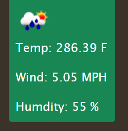
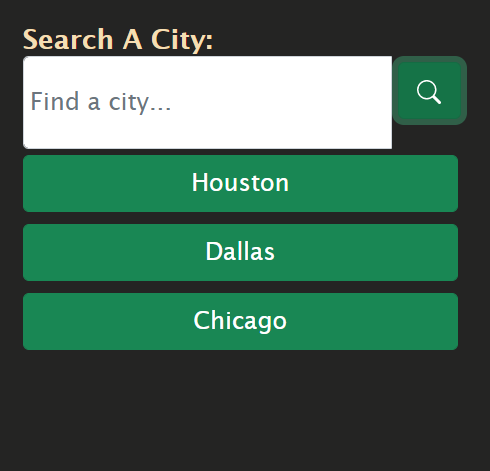

# weather-dashboard

 https://kyliemshinn.github.io/weather-dashboard/

## Description

This project is meant to create a weather app for any city that is looked up in the search bar. You start by searching for the desired city on the left side bar, and the search will populate in the remainder of the web page. It will display a large card with the current weather conditions. Underneath the main card it will display 5 future forecasts of the next five days of the weather conditions.


## Features

Within this web app, there are many parts and features operating at once. The initial feature is to input a city and get back a result of the current weather, as well as the next five day weather conditions for specific features. The current weather will show a UV index with a color that is relative to the number displayed within it.
```
if(uvi < 3) {
    uvBadge.classList.add("btn-success");
} else if (uvi < 7) {
    uvBadge.classList.add("btn-warning");
} else {
    uvBadge.classList.add("btn-danger");
}
```
 On both the current weather and the forecast cards, there is a weather icon that resembles the weather conditions.
 

 Under the search input where you search a specific city, it will save to the page and create a button of past searches you have done.

 

 Once you refresh the page it will reset the search histories.


## Technologies Used
- Open Weather APIs
- JavaScript
- HTML5
- CSS 
- Bootstrap

## Author

Kylie Shinn

* LinkedIn: [LinkedInProfile](https://www.linkedin.com/in/kylie-shinn-18b0301b7/)
* Gmail: kyliemshinn@gmail.com

## License

License
MIT License

Copyright (c) [2022] [Kylie]

Permission is hereby granted, free of charge, to any person obtaining a copy of this software and associated documentation files (the "Software"), to deal in the Software without restriction, including without limitation the rights to use, copy, modify, merge, publish, distribute, sublicense, and/or sell copies of the Software, and to permit persons to whom the Software is furnished to do so, subject to the following conditions:

The above copyright notice and this permission notice shall be included in all copies or substantial portions of the Software.

THE SOFTWARE IS PROVIDED "AS IS", WITHOUT WARRANTY OF ANY KIND, EXPRESS OR IMPLIED, INCLUDING BUT NOT LIMITED TO THE WARRANTIES OF MERCHANTABILITY, FITNESS FOR A PARTICULAR PURPOSE AND NONINFRINGEMENT. IN NO EVENT SHALL THE AUTHORS OR COPYRIGHT HOLDERS BE LIABLE FOR ANY CLAIM, DAMAGES OR OTHER LIABILITY, WHETHER IN AN ACTION OF CONTRACT, TORT OR OTHERWISE, ARISING FROM, OUT OF OR IN CONNECTION WITH THE SOFTWARE OR THE USE OR OTHER DEALINGS IN THE SOFTWARE.

